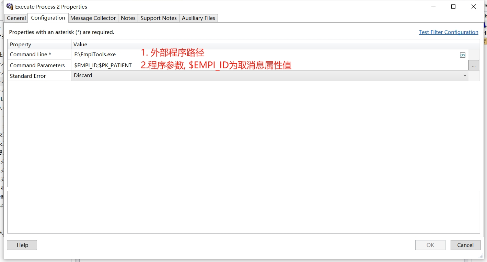

##### Execute Process

用于执行外部程序进程,[参考链接](https://www.alsoapp.com/docs-rhapsody/6.9.1/en/execute-process.html#examples-760)

###### 配置参考

!!! warning "客户端可能出现找不到文件路径问题,请放到服务端执行,若仍出现请重建过滤器"

!!! success "Rhapsody 6.5版本已测试通过"

